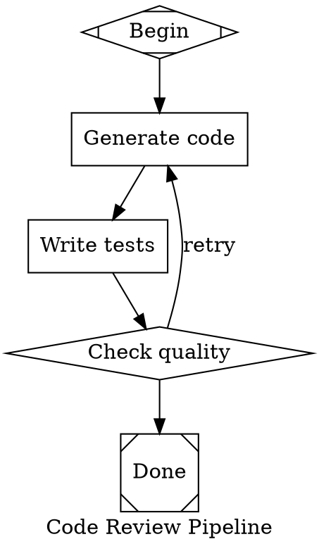

# Attractor DOT Pipeline Specification

Attractor pipelines are defined using a subset of the Graphviz DOT language. Each `.dot` file declares a directed graph (`digraph`) where nodes are pipeline stages and edges define the flow between them.

## File Structure

Every pipeline file must be a single `digraph`:

```dot
digraph pipeline_name {
    graph [ ... ];   // graph-level attributes
    node  [ ... ];   // default node attributes
    edge  [ ... ];   // default edge attributes

    // node declarations
    my_node [shape = box, prompt = "..."];

    // edge declarations
    a -> b;
    a -> b -> c [label = "chain"];
}
```

Comments are supported: `// line comment` and `/* block comment */`.

Semicolons after statements are optional.

---

## Graph Attributes

Set on the `graph` statement. These control the pipeline as a whole.

| Attribute | Type | Description |
|-----------|------|-------------|
| `goal` | string | High-level objective. Expanded into node prompts via `$goal`. |
| `label` | string | Human-readable name for the pipeline. |
| `model_stylesheet` | string | CSS-like rules for centralized LLM configuration (see [Model Stylesheet](#model-stylesheet)). |
| `default_max_retry` | int | Default max retries for all nodes. Default: `50`. |

```dot
graph [
    goal = "Build a REST API for user management",
    label = "User API Pipeline",
    default_max_retry = 3
];
```

---

## Node Shapes

The `shape` attribute determines what kind of handler executes the node. This is the primary way to declare node behavior.

| Shape | Handler | Purpose |
|-------|---------|---------|
| `Mdiamond` | start | **Pipeline entry point.** Exactly one required. No incoming edges allowed. |
| `Msquare` | exit | **Pipeline exit point.** At least one required. No outgoing edges allowed. |
| `box` | codergen | **LLM task.** Sends `prompt` (or `label`) to the LLM and records the response. This is the default shape. |
| `diamond` | conditional | **Routing point.** Passes through successfully; outgoing edges use conditions to choose the next path. |
| `hexagon` | wait.human | **Human gate.** Pauses for human input. Outgoing edge labels become the choices presented. |
| `component` | parallel | **Parallel fan-out.** *(reserved)* |
| `tripleoctagon` | parallel.fan_in | **Parallel fan-in.** *(reserved)* |
| `parallelogram` | tool | **Tool execution.** *(reserved)* |
| `house` | stack.manager_loop | **Manager loop.** *(reserved)* |

If a node has no `shape`, it defaults to `box` (codergen/LLM task).

The `type` attribute can override shape-based handler resolution. If `type` is set and a handler is registered for that type string, it takes precedence over `shape`.

---

## Node Attributes

| Attribute | Type | Default | Description |
|-----------|------|---------|-------------|
| `label` | string | `""` | Display name. Also used as the LLM prompt if `prompt` is not set. |
| `shape` | string | `"box"` | Determines the handler (see table above). |
| `type` | string | `""` | Explicit handler type. Overrides shape-based resolution. |
| `prompt` | string | `""` | Prompt text sent to the LLM for `box` nodes. Supports `$goal` variable expansion. |
| `max_retries` | int | `0` | Max retry attempts for this node. `0` falls back to the graph's `default_max_retry`. |
| `goal_gate` | bool | `false` | If `true`, this node's outcome is checked when the exit node is reached. If it didn't succeed, the pipeline retries from `retry_target`. |
| `retry_target` | string | `""` | Node ID to jump back to when this goal gate fails. |
| `fallback_retry_target` | string | `""` | Secondary retry target if `retry_target` is not set. |
| `allow_partial` | bool | `false` | If `true`, accept `partial_success` when retries are exhausted instead of failing. |
| `auto_status` | bool | `false` | *(reserved)* |
| `fidelity` | string | `""` | Context fidelity mode. Valid values: `full`, `truncate`, `compact`, `summary:low`, `summary:medium`, `summary:high`. |
| `thread_id` | string | `""` | *(reserved for parallel execution)* |
| `timeout` | string | `null` | Execution timeout (e.g. `"30s"`, `"5m"`). *(reserved)* |
| `class` | string | `""` | Comma-separated CSS class names for model stylesheet matching. |
| `llm_model` | string | `""` | Override LLM model for this node (e.g. `"claude-opus-4-6"`). |
| `llm_provider` | string | `""` | Override LLM provider for this node (e.g. `"anthropic"`, `"openai"`). |
| `reasoning_effort` | string | `"high"` | LLM reasoning effort: `"low"`, `"medium"`, or `"high"`. |

```dot
generate [
    shape = box,
    label = "Generate code",
    prompt = "Write a function that $goal",
    max_retries = 3,
    llm_model = "claude-opus-4-6"
];

review [
    shape = diamond,
    label = "Quality check",
    goal_gate = true,
    retry_target = "generate"
];
```

---

## Edge Attributes

| Attribute | Type | Default | Description |
|-----------|------|---------|-------------|
| `label` | string | `""` | Display label. For `hexagon` (human gate) nodes, edge labels become the choices shown to the user. |
| `condition` | string | `""` | Condition expression that must be true for this edge to be taken (see [Condition Language](#condition-language)). |
| `weight` | int | `0` | Priority. Higher weight wins when multiple edges match. |
| `fidelity` | string | `""` | *(reserved)* |
| `thread_id` | string | `""` | *(reserved)* |
| `loop_restart` | bool | `false` | If `true`, taking this edge restarts the entire pipeline. |

```dot
check -> done  [condition = "outcome=success"];
check -> retry [condition = "outcome=fail", label = "retry", weight = 10];
```

### Edge Chains

Multiple edges can be declared in a single statement:

```dot
a -> b -> c -> d;
```

This creates three edges: `a->b`, `b->c`, `c->d`. Attributes on a chain apply to all edges in it.

---

## Condition Language

Edge conditions are boolean expressions evaluated against the current node's outcome and the pipeline context.

### Operators

| Syntax | Meaning |
|--------|---------|
| `key=value` | Equality check |
| `key!=value` | Inequality check |
| `clause1 && clause2` | Logical AND (all clauses must be true) |
| `key` | Bare key — truthy check |

### Resolvable Keys

| Key | Resolves to |
|-----|-------------|
| `outcome` | The current node's status: `success`, `partial_success`, `retry`, `fail`, `skipped` |
| `preferred_label` | The preferred label string returned by the handler |
| `context.KEY` | Value of `KEY` in the pipeline context store |
| `KEY` | Falls back to context lookup if not a built-in key |

### Examples

```dot
// Take this edge only on success
a -> b [condition = "outcome=success"];

// Take this edge on failure
a -> c [condition = "outcome=fail"];

// Compound condition
a -> d [condition = "outcome=success && context.mode=fast"];

// Not-equal
a -> e [condition = "outcome!=fail"];
```

---

## Edge Selection Algorithm

When a node completes, the engine selects the next edge using this 5-step priority:

1. **Condition match** — Edges with a `condition` that evaluates to true. If multiple match, the one with the highest `weight` wins.
2. **Preferred label** — If the handler returned a `preferred_label`, match it against edge labels (case-insensitive).
3. **Suggested next IDs** — If the handler returned `suggested_next_ids`, match against edge targets.
4. **Unconditional edges** — Edges with no `condition`, selected by highest `weight`.
5. **Lexical tiebreak** — If weights are equal, the edge whose target node ID comes first alphabetically wins.

---

## Default Attributes

Use `node [...]` and `edge [...]` statements to set defaults inherited by all subsequent nodes/edges:

```dot
node [shape = box, reasoning_effort = "medium"];
edge [weight = 1];

step1 [prompt = "..."]; // inherits shape=box, reasoning_effort=medium
step2 [prompt = "..."]; // same
```

Per-node or per-edge attributes override defaults.

---

## Subgraphs

Subgraphs group nodes visually but are flattened into the parent graph during parsing:

```dot
subgraph cluster_phase1 {
    step1 [shape = box, prompt = "..."];
    step2 [shape = box, prompt = "..."];
    step1 -> step2;
}
```

Nodes inside subgraphs inherit the default node attributes of the parent scope.

---

## Model Stylesheet

The `model_stylesheet` graph attribute accepts CSS-like rules that configure LLM settings across nodes. This avoids repeating `llm_model`/`llm_provider` on every node.

### Syntax

```
selector { property: value; property: value; }
```

### Selectors

| Selector | Specificity | Matches |
|----------|-------------|---------|
| `*` | 0 | All nodes |
| `.classname` | 1 | Nodes with `class = "classname"` |
| `#nodeid` | 2 | Node with that exact ID |

Higher specificity wins. Within the same specificity, later rules override earlier ones.

### Properties

| Property | Description |
|----------|-------------|
| `llm_model` | Model ID (e.g. `claude-sonnet-4-5-20250929`, `gpt-4o`) |
| `llm_provider` | Provider name (`anthropic`, `openai`) |
| `reasoning_effort` | `low`, `medium`, or `high` |

### Example

```dot
graph [
    model_stylesheet = "* { llm_model: gpt-4o; reasoning_effort: medium; } .critical { llm_model: claude-opus-4-6; reasoning_effort: high; } #final_review { llm_model: claude-opus-4-6; }"
];

step1 [shape = box, class = "critical", prompt = "..."];
step2 [shape = box, prompt = "..."];
final_review [shape = box, prompt = "..."];
```

- `step1` gets `claude-opus-4-6` (from `.critical`, specificity 1 > 0)
- `step2` gets `gpt-4o` (from `*`)
- `final_review` gets `claude-opus-4-6` (from `#final_review`, specificity 2 > 0)

Explicit `llm_model` or `llm_provider` set directly on a node attribute will be overridden by stylesheet rules.

---

## Variable Expansion

Within node `prompt` attributes, the following variable is expanded at execution time:

| Variable | Expands to |
|----------|------------|
| `$goal` | The `goal` value from the graph attributes |

```dot
graph [goal = "Sort a list of integers"];
step [shape = box, prompt = "Write a Python function to $goal"];
// prompt becomes: "Write a Python function to Sort a list of integers"
```

---

## Pipeline Context

The engine maintains a key-value context store that accumulates state as the pipeline runs. Each node's handler can write updates into context, and subsequent nodes (via the LLM backend) receive prior stage outputs as context.

Context keys set automatically by the engine:

| Key | Value |
|-----|-------|
| `graph.goal` | The graph's `goal` attribute |
| `graph.label` | The graph's `label` attribute |
| `outcome` | The last node's status string (e.g. `"success"`) |
| `preferred_label` | The last node's preferred label (if any) |
| `last_stage` | ID of the last completed node |
| `last_response` | First 200 characters of the last LLM response |
| `stage.<node_id>.response` | Full LLM response text for that stage |

Edge conditions can read these via `context.KEY` syntax.

---

## Goal Gates

Nodes with `goal_gate = true` are checked when the pipeline reaches an exit node. If any goal gate node did not finish with `success` or `partial_success`, the engine jumps back to the node specified by `retry_target` (or `fallback_retry_target`) and re-executes from there.

If no retry target is available, the pipeline fails.

```dot
validate [shape = diamond, goal_gate = true, retry_target = "generate"];
```

---

## Checkpointing

The engine writes a `checkpoint.json` file to the logs directory after each node completes. It contains:

- Current node ID
- List of completed node IDs
- Retry counts per node
- Full context snapshot

---

## Validation Rules

Run `attractor validate <file.dot>` to lint a pipeline. The following rules are checked:

| Rule | Severity | Description |
|------|----------|-------------|
| `start_node` | ERROR | Exactly one node with `shape=Mdiamond` must exist |
| `terminal_node` | ERROR | At least one node with `shape=Msquare` must exist |
| `reachability` | ERROR | All nodes must be reachable from the start node |
| `edge_target_exists` | ERROR | All edge source and target node IDs must exist |
| `start_no_incoming` | ERROR | Start node must not have incoming edges |
| `exit_no_outgoing` | ERROR | Exit node must not have outgoing edges |
| `condition_syntax` | ERROR | All edge conditions must be syntactically valid |
| `retry_target_exists` | WARNING | Retry target node IDs must exist in the graph |
| `goal_gate_has_retry` | WARNING | Goal gate nodes should have a `retry_target` |
| `prompt_on_llm_nodes` | WARNING | `box` nodes should have a `prompt` or `label` |

---

## Complete Example


