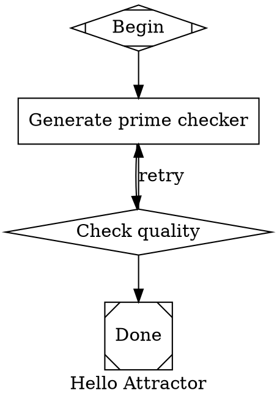

# Attractor

Deterministic execution harness for LLM agent pipelines.

Attractor lets you define multi-stage LLM workflows as directed graphs using Graphviz DOT syntax. A pipeline engine executes the graph — calling LLMs, running tools, waiting for human input, and routing between stages based on conditions — with built-in retries, checkpointing, and validation.

## Quick start

```bash
pip install -e .

# Run a pipeline (simulated, no API key needed)
attractor run examples/hello.dot --simulate

# Run with a real LLM
attractor run examples/hello.dot --model claude-sonnet-4-5-20250929

# Validate a pipeline without running it
attractor validate examples/hello.dot
```

## Defining a pipeline

Pipelines are `.dot` files — directed graphs where nodes are stages and edges are transitions:



## Node types

Node behavior is determined by the `shape` attribute:

| Shape | Role | Description |
|-------|------|-------------|
| `Mdiamond` | Start | Pipeline entry point (exactly one required) |
| `Msquare` | Exit | Pipeline exit point (at least one required) |
| `box` | LLM task | Sends `prompt` to the LLM, records the response |
| `diamond` | Conditional | Routes to the next stage based on the previous outcome |
| `hexagon` | Human gate | Pauses for human input or approval |
| `parallelogram` | Tool | Runs a built-in tool (validate, read/write files) |

## Key features

- **Conditional routing** — edges have `condition` expressions (`outcome=success`, `preferred_label=done`, `context.key=value`) evaluated at runtime
- **Retries with backoff** — configurable per-node or graph-wide via `default_max_retry`
- **Goal gates** — mark critical nodes with `goal_gate = true`; the engine re-routes if they didn't succeed before reaching the exit
- **Checkpointing** — engine writes `checkpoint.json` after each stage for crash recovery
- **Model stylesheets** — CSS-like rules for centralized LLM configuration across nodes
- **`$goal` expansion** — reference the graph-level goal inside any prompt

See [DOT_SPEC.md](DOT_SPEC.md) for the full pipeline language reference.

## CLI commands

```
attractor run <file.dot>       Run a pipeline
  --simulate / -s              Use simulated LLM (no API key)
  --model / -m <model-id>      LLM model to use
  --interactive / -i           Enable human gates
  --logs <dir>                 Log output directory (default: ./logs)

attractor validate <file.dot>  Lint a pipeline without running it

attractor agent                Start an interactive coding agent session
  --prompt / -p <text>         Run a single prompt non-interactively
```

## Development

Requires Python >= 3.11.

```bash
pip install -e ".[dev]"
pytest tests/
```

## License

Apache-2.0
